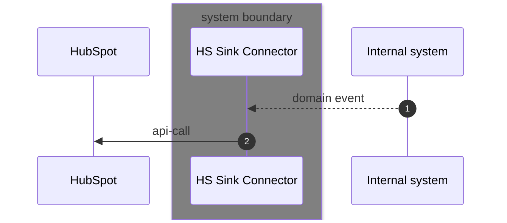

Integration patterns
====================

Ingress
```mermaid
sequenceDiagram
    autonumber
    participant HubSpot 
    box Grey integration anti-corruption layer
    participant HS Webhook Connector
    participant HS Webhook Processor
    end        participant Internal system 
    
    
    HubSpot ->> HS Webhook Connector: webhook payload
    HS Webhook Connector -->> HS Webhook Processor: webook payload event
    HS Webhook Processor <-> HubSpot: enrichment 
    HS Webhook Processor -->> Internal system: integration event
```
Egress
