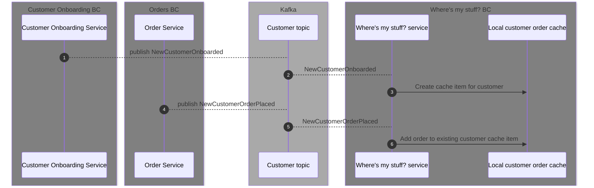

Using Kafka events for event-sourcing when projecting into local cache
======================================================================
Egress

```mermaid
sequenceDiagram
    autonumber
    box Grey Customer Onboarding BC
    participant Customer Onboarding Service
    end
    box Grey Orders BC
    participant Order Service
    end
    box DarkGrey Kafka
    participant Customer topic
    end    
    box Grey Where's my stuff? BC
    participant Where's my stuff? service
    participant Local customer order cache
    end

    Customer Onboarding Service --> Customer topic: publish NewCustomerOnboarded
    Customer topic --> Where's my stuff? service: NewCustomerOnboarded
    Where's my stuff? service ->> Local customer order cache: Create cache item for customer
    Order Service --> Customer topic: publish NewCustomerOrderPlaced
    Customer topic --> Where's my stuff? service: NewCustomerOrderPlaced
    Where's my stuff? service ->> Local customer order cache: Add order to existing customer cache item
```